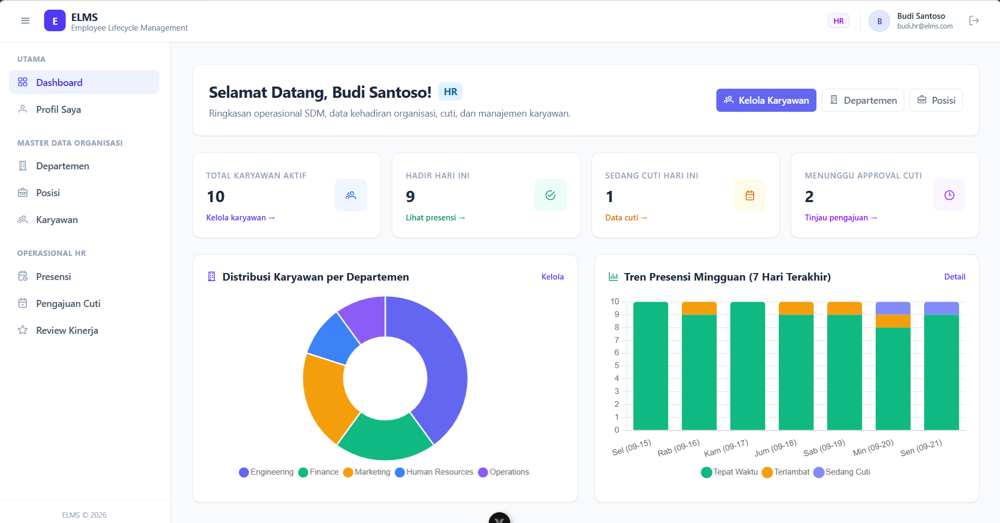
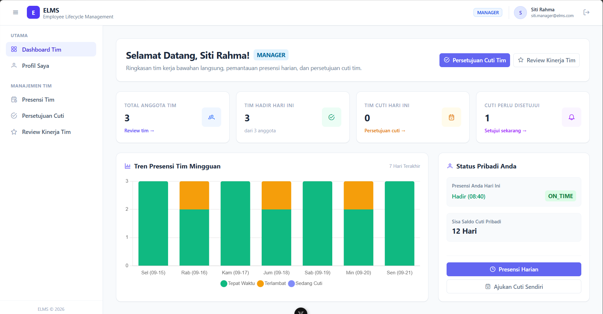
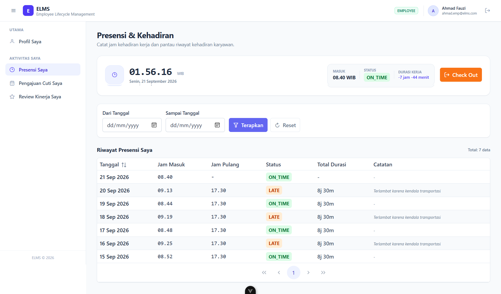
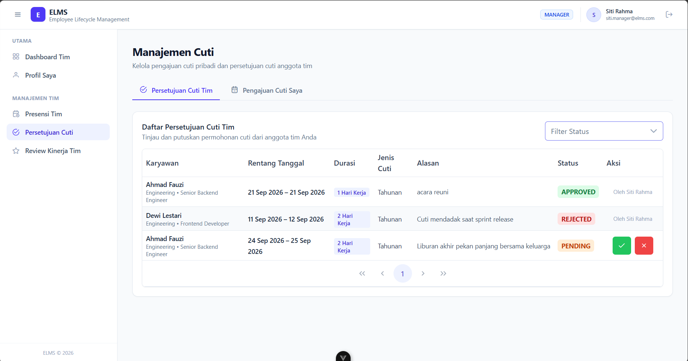
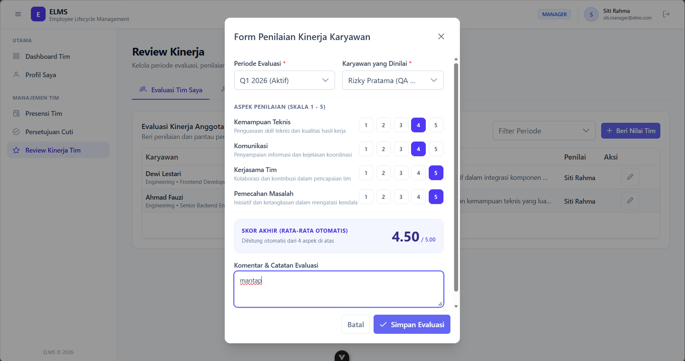
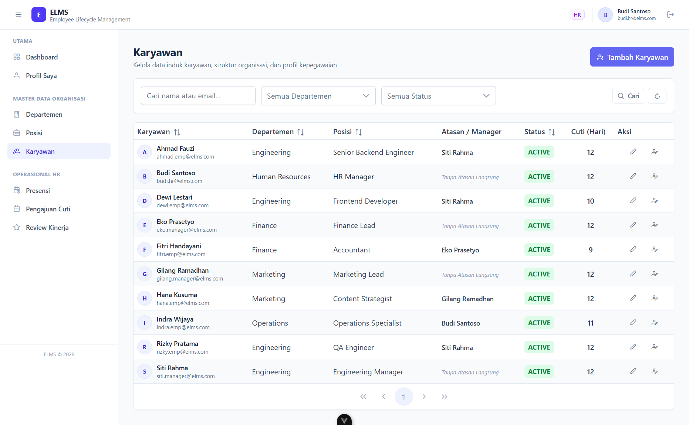

# Employee Lifecycle Management System (ELMS)

ELMS adalah sistem manajemen siklus hidup karyawan (*employee lifecycle*) berskala *enterprise MVP* yang memodelkan alur kerja nyata: **Onboarding & Master Organisasi → Presensi Harian (Toleransi & Ambang Batas) → Manajemen Cuti (Workflow Persetujuan & Pessimistic Locking) → Evaluasi Kinerja (Performance Review Multi-Aspek) → Executive & Team Dashboard**.

---

## 💡 Latar Belakang & Pendekatan Pengembangan (Vibe Coding & Learning Journey)

> *"The best way to master a new tech stack is not by building another Todo App, but by building a real-world system with complex business rules and architectural challenges."*

Proyek ini lahir dari keinginan untuk **mengeksplorasi dan menguasai *tech stack* modern** (Java 21 / Spring Boot, Vue 3 Composition API, PrimeVue, Tailwind CSS, dan PostgreSQL) melalui studi kasus dunia nyata yang sering ditemukan pada ekosistem korporat (*HRIS / Employee Management*).

Dalam proses pengembangannya, proyek ini menerapkan paradigma **"Vibe Coding" (AI-Assisted Pair Programming)**:
1. **Developer sebagai Architect & Domain Driver**: Menentukan *business logic*, spesifikasi API, pemodelan data, *edge cases*, dan tata kelola keamanan.
2. **AI Agent sebagai Co-Pilot & Pair Programmer**: Membantu akselerasi penulisan *boilerplate*, refactoring komponen, sintesis dokumentasi teknis, dan perancangan *automated test suite*.
3. **Standar Rekayasa Perangkat Lunak Tetap Utama**: Meskipun dibangun dengan bantuan AI, proyek ini **tidak mengorbankan kualitas rekayasa**. Seluruh aturan *clean architecture*, penanganan *concurrency race condition*, isolasi DTO, dan rangkaian **57 unit test otomatis** dijaga dengan disiplin tinggi.

---

## 🌟 Highlight Teknis & Keputusan Arsitektur

* **Controller Tipis, Service Kaya Domain**: Controller hanya mengurus validasi format payload dan HTTP response status. Semua aturan bisnis, orkestrasi validasi, dan transaksi berada di Service Layer (`@Transactional`).
* **Strict Two-Tier Authorization**:
  1. *Coarse-grained (Role-based)*: Dicek di level endpoint via Spring Security `@PreAuthorize("hasRole('...')")`.
  2. *Fine-grained (Data-scope)*: Dicek di level query/service bean (contoh: Manager hanya dapat menyetujui cuti dan melihat absensi tim yang melapor langsung kepadanya via `manager_id`).
* **Atomic Leave Deduction & Concurrency Handling**:
  * Pengajuan cuti tidak langsung memotong saldo (status `PENDING`).
  * Saat *approval*, baris pemohon dikunci (*pessimistic locking* / transactional barrier) dan saldo divalidasi ulang sebelum dikurangi untuk mencegah *over-allocation* jika ada approval paralel.
* **Standardized API Contract**: Seluruh *response* dan *exception* dibungkus seragam (`ApiResponse<T>`) dengan kode error domain terprediksi (`LEAVE_BALANCE_INSUFFICIENT`, `ALREADY_CHECKED_IN`, dll.), tanpa pernah membocorkan *stack trace* ke client.
* **Thin Reusable UI Wrapper**: Mengisolasi *third-party component library* (PrimeVue) ke dalam `Base*.vue` wrappers, mencegah vendor lock-in dan menjaga konsistensi desain Tailwind.

---

## 📸 Galeri & Cuplikan Antarmuka (Screenshots Preview)

Berikut adalah panduan cuplikan antarmuka utama sistem ELMS:

### 1. Executive HR Dashboard (Cakupan Organisasi Penuh)
> *Menampilkan 4 kartu ringkasan eksekutif, Donut Chart distribusi karyawan per departemen, serta Stacked Bar Chart tren presensi 7 hari terakhir.*
>
> 

### 2. Manager Dashboard (Cakupan Tim Bawahan)
> *Menampilkan data tim langsung yang diawasi oleh manajer, kartu persetujuan cuti pending bawahan, dan tren presensi tim.*
>
> 

### 3. Employee Personal Home & Presensi Harian
> *Beranda karyawan: jam check-in hari ini, status ON_TIME / LATE (ambang batas 09:00 WIB), dan sisa saldo cuti tahunan.*
>
> 

### 4. Manajemen & Alur Persetujuan Cuti (Leave Approval Workflow)
> *Formulir pengajuan cuti dengan penghitung otomatis hari kerja (skip Sabtu/Minggu) serta halaman persetujuan atasan dengan dialog konfirmasi.*
>
> 

### 5. Evaluasi Kinerja (Performance Review Matrix)
> *Formulir evaluasi manajer dengan 4 aspek kompetensi (skala 1–5), live average calculation (2 desimal), dan riwayat nilai bagi karyawan.*
>
> 

### 6. Direktori Master Data Karyawan & Organisasi
> *Tabel master karyawan berpaginasi lengkap dengan pencarian, filter departemen, dan pemetaan hierarki atasan langsung.*
>
> 

---

## 🛠️ Tech Stack

### Backend
- **Language & Framework**: Java 21, Spring Boot 4.1.1
- **Persistence**: Spring Data JPA, Hibernate, PostgreSQL 16+ (Local Native)
- **Security**: Spring Security 6, Stateless JWT (`jjwt` HS256), BCrypt Hashing
- **Validation**: Hibernate Validator (Bean Validation API)
- **API Documentation**: Springdoc OpenAPI (Swagger UI)
- **Automated Testing**: JUnit 5, Mockito (57 Unit Tests Lulus)

### Frontend
- **Framework**: Vue 3 (Composition API `<script setup>`), Vite
- **State Management**: Pinia (Modular Domain Stores)
- **Routing**: Vue Router 4 (Navigation Guards & RBAC Role Protection)
- **UI Components & Styling**: PrimeVue (Aura Preset) + Tailwind CSS v4
- **Charts & Data Visualization**: Chart.js (via `BaseChart.vue`)
- **HTTP Client**: Axios (Centralized Interceptors untuk token injection & handling)

---

## 📐 Arsitektur Monorepo

```text
elms/
├── backend/                  # Maven Spring Boot Application
│   └── src/main/java/com/elms/backend/
│       ├── common/           # Response wrapper, GlobalExceptionHandler, JWT, Config, Seeder
│       ├── auth/             # AuthController, AuthService, Security, UserDetails
│       ├── organization/     # Department & Position Management
│       ├── employee/         # Employee CRUD, Self-referencing Manager, Specification
│       ├── attendance/       # Daily Check-in/out, Duration, Late Calculation
│       ├── leave/            # Leave Requests, Balance Deduction, Concurrency Barrier
│       ├── performance/      # Review Periods, Evaluation Form, Score Aggregation
│       └── dashboard/        # Role-Scoped Analytics & Chart Data Aggregations
├── frontend/                 # Vite + Vue 3 Application
│   └── src/
│       ├── api/              # Domain-specific Axios wrappers
│       ├── components/       # Layouts & Reusable Base*.vue (BaseTable, BaseChart, etc.)
│       ├── stores/           # Pinia Stores (auth, leave, attendance, dashboard, etc.)
│       ├── views/            # Route Pages (Dashboard, Leave, Performance, etc.)
│       └── router/           # Navigation Guards & RBAC Routes
└── docs/                     # PRD, Architecture, Data Model, Tasks, & UI Conventions
```

---

## 📋 Matriks Hak Akses (RBAC)

| Modul / Tindakan | Employee | Manager | HR / Admin |
|---|:---:|:---:|:---:|
| Lihat Profil Sendiri | ✅ | ✅ | ✅ |
| Presensi Harian (Check-in / Check-out) | ✅ | ✅ | ✅ |
| Pengajuan Cuti Pribadi | ✅ | ✅ | ✅ |
| Approval / Rejection Cuti Tim | ❌ | ✅ (Hanya bawahan langsung) | ✅ (Seluruh tim) |
| Master Data (Departemen, Posisi, Karyawan) | ❌ | ❌ | ✅ |
| Evaluasi Kinerja Tim (Beri Nilai) | ❌ | ✅ (Hanya bawahan langsung) | ❌ (Read-only) |
| Dashboard & Visualisasi Grafik | ✅ (Personal) | ✅ (Lingkup Tim) | ✅ (Global Perusahaan) |

---

## 🚀 Panduan Instalasi Lokal

### Prasyarat
- Java Development Kit (JDK 21)
- Node.js (v18+ atau LTS terbaru)
- PostgreSQL terpasang lokal (Default port: `5432`)

### 1. Database
Buat database lokal pada PostgreSQL:
```sql
CREATE DATABASE elms_db;
```

### 2. Backend Setup
1. Masuk ke direktori `backend/`:
   ```bash
   cd backend
   ```
2. Sesuaikan kredensial database di `src/main/resources/application-dev.yml`:
   ```yaml
   spring:
     datasource:
       url: jdbc:postgresql://localhost:5432/elms_db
       username: postgres
       password: your_password
   ```
3. Jalankan aplikasi Spring Boot:
   ```bash
   ./mvnw spring-boot:run
   ```tamb
   * *API Server:* `http://localhost:8080`
   * *Swagger UI:* `http://localhost:8080/swagger-ui.html`

### 3. Frontend Setup
1. Masuk ke direktori `frontend/`:
   ```bash
   cd frontend
   ```
2. Salin environment variable & pasang dependensi:
   ```bash
   npm install
   npm run dev
   ```
   * *Aplikasi Web:* `http://localhost:5173`

---

## 🔑 Kredensial Akun Default (Demo & Development)

Aplikasi dilengkapi dengan **Data Seeder Otomatis** (profil `dev`) yang mengisi data realistis: 10 karyawan di 5 departemen, data kehadiran 7 hari terakhir, pengajuan cuti berbagai status, dan periode review kinerja.

Semua akun demo menggunakan password default: **`password123`**

| Role | Akun Demo (Email) | Jabatan & Departemen | Wewenang Utama |
|---|---|---|---|
| **HR / Admin** | `budi.hr@elms.com` | HR Manager (Human Resources) | Kelola seluruh master data, buat periode review, akses metrik global |
| **Manager** | `siti.manager@elms.com` | Engineering Manager (Engineering) | Approval cuti tim dev, penilaian performa Ahmad, Dewi, & Rizky |
| **Manager** | `eko.manager@elms.com` | Finance Lead (Finance) | Approval cuti divisi keuangan |
| **Manager** | `gilang.manager@elms.com` | Marketing Lead (Marketing) | Approval cuti divisi marketing |
| **Employee** | `ahmad.emp@elms.com` | Sr. Backend Engineer (Engineering) | Presensi, pengajuan cuti (pending), lihat hasil review |
| **Employee** | `dewi.emp@elms.com` | Frontend Developer (Engineering) | Presensi, pengajuan cuti, lihat hasil review |
| **Employee** | `fitri.emp@elms.com` | Accountant (Finance) | Contoh karyawan sedang cuti aktif hari ini |

---

## 🧪 Pengujian Otomatis

Seluruh logika bisnis inti diuji menggunakan unit testing komprehensif:
```bash
cd backend
./mvnw test
```
*Hasil: 57 tests passed, 0 failures, 0 errors.*

---